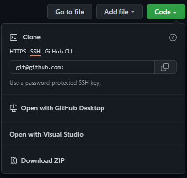

<!--

This document is written in Markdown.
You can preview on such as VisualStudio Code.
If you want to know more, search with "vscode markdown" or refer to official document https://code.visualstudio.com/Docs/languages/markdown .

-->

# GitHubのSSH接続

GitHubからコードをcloneしてくる方法にSSHを用いる方法がある。これにより毎回、GitHubのアカウントのパスワードを入力する必要がなくなり、よろしくはないがパスワードなし公開鍵暗号を使えばパスワードなしでコードをcloneしてくることができる。



## 手順

1. 鍵の生成

	詳細は、[前項](./ssh_pubkey.md)を参照してほしいが

	```
	ssh-keygen -t ed25519
	```
	で鍵を生成する。

2. GitHubに鍵の登録

	https://github.com/settings/keys

	

	ここからSSH keysを追加する。

	

3. ssh_configを作成

	`ssh_config.d/`に`github.conf`でも追加

	Windowsの場合は~/.ssh/configなどに追記

	```
	Host github.com
		Name git
		HostName github.com
		IdentityFile _SECRET_KEY_PATH_
	```

	ただしWindowsの場合、\_SECRET\_KEY\_PATH\_は絶対パス


4. clone

	```
	git clone git@github.com:...
	```

---

[Back to home](../readme.md)

<!-- Written by Croyfet in 2022-->
